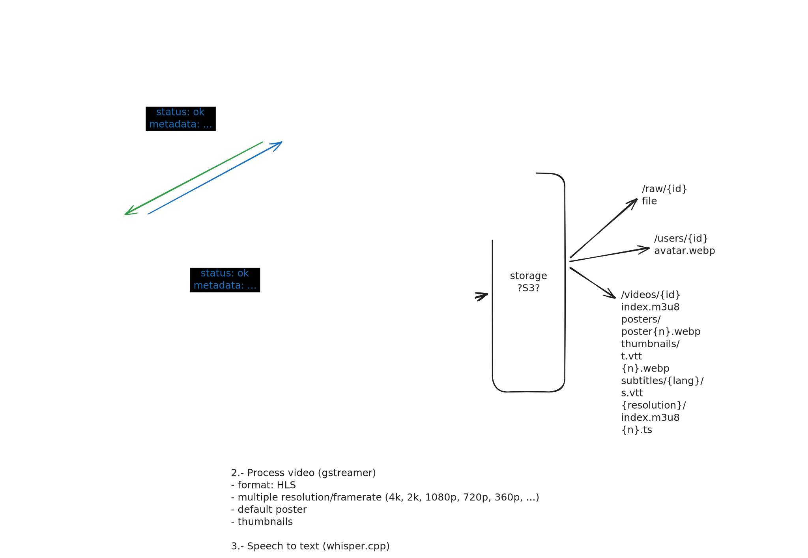
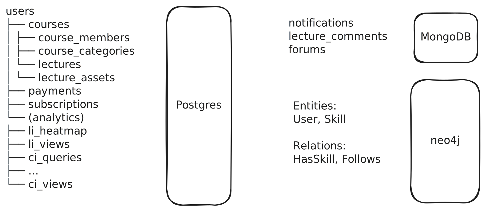

# Documentación Técnica: Plataforma de Cursos Online

## 1. Introducción
Este documento describe la arquitectura técnica de una plataforma web escalable para la gestión y visualización de cursos online. El sistema está diseñado utilizando una arquitectura de microservicios para separar responsabilidades, mejorar la escalabilidad y permitir el uso de tecnologías específicas para cada tarea.

## 2. Arquitectura del Sistema
El sistema se compone de tres servicios backend principales, una aplicación frontend.

### Diagrama de Alto Nivel
*   **Frontend (React)** interactúa con Backend A y Backend B.
*   **Backend A (Go)** maneja la lógica de negocio de los cursos.
*   **Backend B (Rust)** maneja la identidad y pagos.
*   **RabbitMQ** actúa como bus de mensajes para tareas asíncronas.
*   **Backend C (Rust)** consume tareas de RabbitMQ para procesamiento pesado de medios

## 3. Componentes del Backend

### 3.1. Backend A: Servicio de Gestión de Cursos (Core)
*   **Lenguaje**: Go
*   **Framework**: Gin
*   **Responsabilidades**:
    *   **Dashboard de Cursos**: Dashboard completo de cursos, módulos y lecciones.
    *   **Gestión de Eventos**: Publicación de eventos de "Nuevo Video Subido" a RabbitMQ.
*   **Interacción**: Expone una API REST para el Frontend.

### 3.2. Backend B: Servicio de Identidad y Pagos
*   **Lenguaje**: Rust
*   **Framework**: Axum
*   **Responsabilidades**:
    *   **Autenticación y Autorización**: Registro, Login, gestión de sesiones (JWT/OAuth).
    *   **Pagos**: Integración con Stripe para suscripciones y compras únicas.
*   **Seguridad**: Manejo seguro de credenciales.

### 3.3. Backend C: Worker Pool (Procesamiento de Medios)
*   **Lenguaje**: Rust
*   **Arquitectura**: Server Pool (Escalado horizontal).
*   **Mecanismo de Trabajo**:
    *   Consume mensajes de una cola de **RabbitMQ**.
    *   Procesa videos secuencialmente (1 a 1 por instancia) para controlar la carga de CPU/GPU.
*   **Tecnologías Clave**:
    *   **GStreamer**: Para transcodificación de video, generación y optimización imágenes y streaming (HLS/DASH).
    *   **Whisper.cpp (whisper-rs)**: Para la transcripción y traducción automática de audio a texto (subtítulos).

Flujo de trabajo que seguirá una petición de subir un vídeo

## 4. Capa de Datos

El sistema utiliza múltiples motores de base de datos, eligiendo la herramienta adecuada para cada tipo de dato:

*   **PostgreSQL (con TimescaleDB)**:
    *   *Uso*: Datos relacionales core.
    *   *Entidades*: Usuarios (perfil básico), Metadatos de Cursos, Inscripciones, Progreso de estudiantes (series temporales con TimescaleDB).
*   **MongoDB**:
    *   *Uso*: Datos no estructurados o semi-estructurados de alto volumen.
    *   *Entidades*: Comentarios, Notificaciones, Foros de discusión.
*   **Neo4j**:
    *   *Uso*: Motor de recomendaciones y relaciones complejas.
    *   *Entidades*: Grafo social (quién sigue a quién), Recomendaciones de cursos ("Usuarios que vieron X también vieron Y"), Árboles de conocimiento.

## 5. Frontend

*   **Framework**: React
*   **Cliente HTTP**: Axios (para comunicación con Backend A y B).
*   **Estado**: React query
*   **Estilos**: tailwind css, shadcn
*   **Características**:
    *   SPA (Single Page Application) con React router i Lazy loading.
    *   Reproductor de video adaptativo
    *   Gestión de estado global para usuario
    *   Dashboard de gestión de cursos con animaciones (drag and drop, desplegables, ...)

## 6. Infraestructura y Mensajería

*   **RabbitMQ**:
    *   Desacopla la subida de videos (Backend A) del procesamiento (Backend C).
    *   Garantiza que picos de subidas no saturen los servidores de procesamiento.
