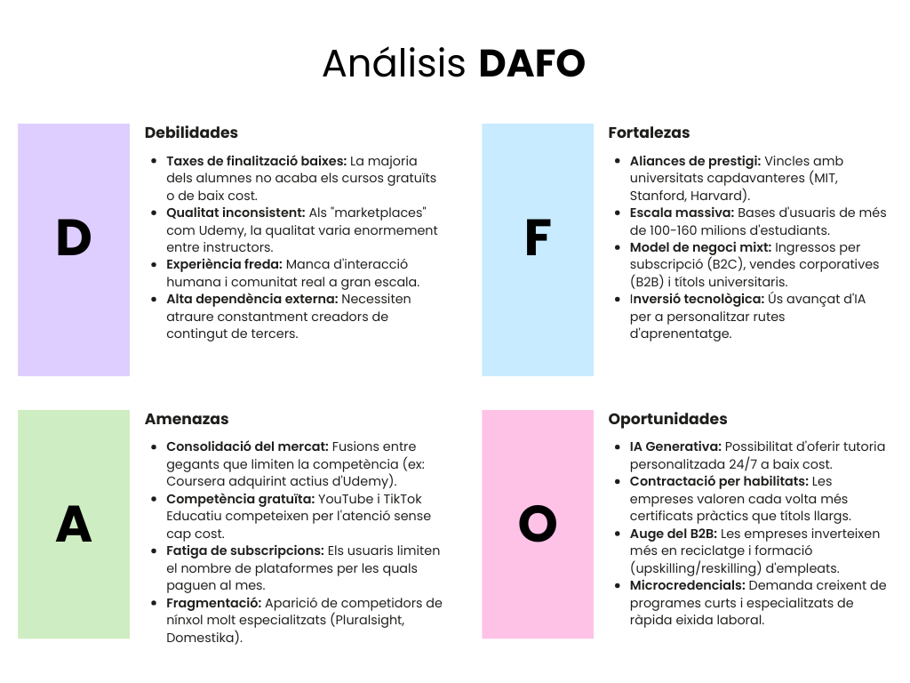
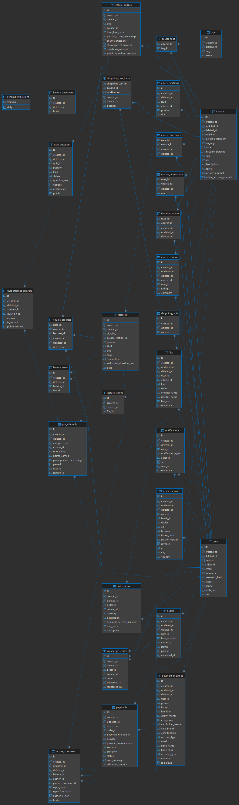
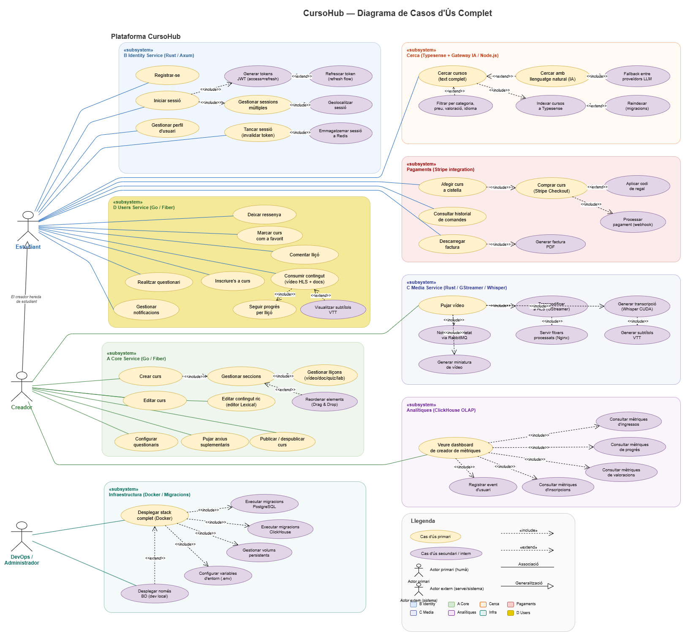
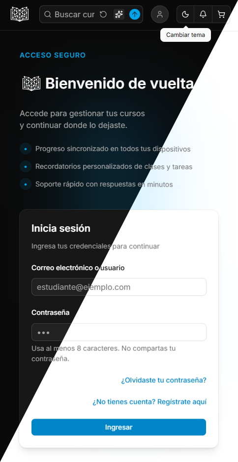
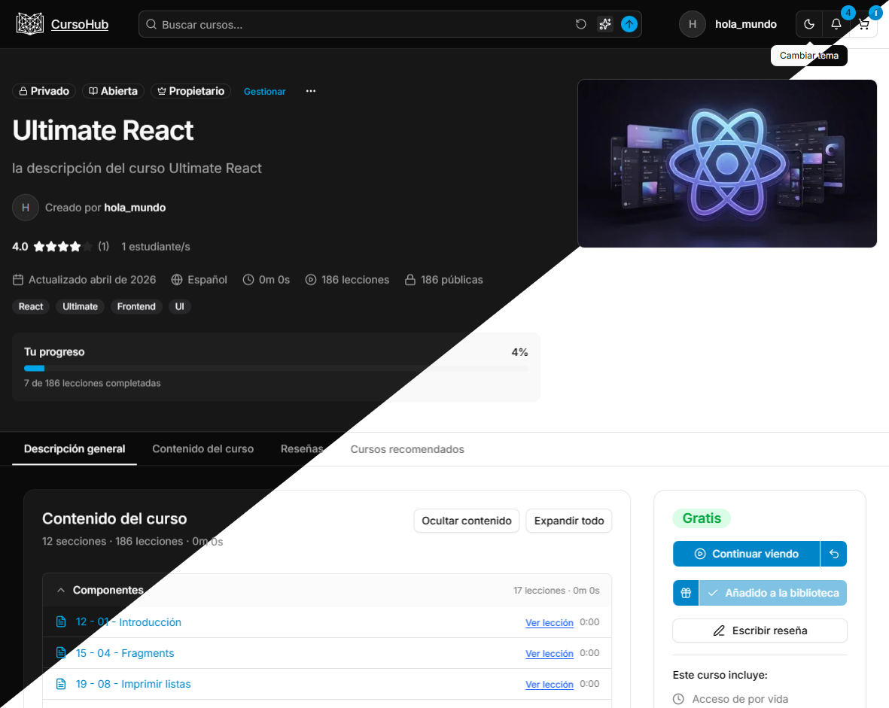

# CursoHub — Plataforma de Cursos Online

> Plataforma distribuïda de formació online amb arquitectura de microserveis, processament multimèdia asíncron, cerca amb IA i integració de pagaments.


## Taula de continguts

1. [Introducció](#1-introducció)
   - 1.1. [Idea de negoci](#11-idea-de-negoci)
   - 1.2. [Objectius](#12-objectius)
   - 1.3. [Anàlisi del mercat i segmentació. Competència. DAFO](#13-anàlisi-del-mercat-i-segmentació-competència-dafo)
   - 1.4. [Alineació amb objectius, valors, sostenibilitat i futur (ODS)](#14-alineació-amb-objectius-valors-sostenibilitat-i-futur-ods)
2. [Anàlisi dels requeriments](#2-anàlisi-dels-requeriments)
   - 2.1. [Entitat Relació](#21-entitat-relació)
   - 2.2. [Diagrama de classes i casos d'ús](#22-diagrama-de-classes-i-casos-dús)
   - 2.3. [Disseny](#23-disseny)
   - 2.4. [Tecnologies](#24-tecnologies)
   - 2.5. [Planificació](#25-planificació)
3. [Implementació](#3-implementació)
   - 3.1. [Desplegament](#31-desplegament)
   - 3.2. [Backend](#32-backend)
   - 3.3. [Frontend](#33-frontend)
   - 3.4. [Disseny](#34-disseny)
4. [Millores futures](#4-millores-futures)
5. [Conclusions](#5-conclusions)
6. [Referències bibliogràfiques](#6-referències-bibliogràfiques)

---

## 1. Introducció

### 1.1. Idea de negoci

CursoHub és una plataforma digital on creadors puguen publicar cursos i estudiants puguen adquirir-los, consumir contingut multimèdia i fer seguiment del seu aprenentatge.

Punts clau:
- Monetització mitjançant compra de cursos i codis de regal.
- Escalabilitat amb serveis separats per funcionalitat (microserveis).
- Experiència d'usuari orientada a l'aprenentatge continu.
- Analítiques sobre el comportament dels usuaris per als creadors de cursos.

### 1.2. Objectius

**Generals:**
- Desenvolupar una plataforma robusta i escalable de formació online.
- Facilitar la gestió de cursos per part dels creadors.
- Oferir una experiència fluida a l'hora de compra i consum de cursos.

**Específics:**
- Implementar autenticació i gestió de perfils amb sessions múltiples.
- Permetre cerca i filtrat avançat de cursos amb IA (consultes en llenguatge natural).
- Integrar passarel·la de pagament (Stripe) amb suport de codis de regal.
- Proporcionar analítica bàsica per a creadors.
- Processar contingut multimèdia de forma asíncrona (transcodificació, transcripció).

### 1.3. Anàlisi del mercat i segmentació. Competència. DAFO

**Segmentació:**
- Segment principal: estudiants i professionals que volen millorar habilitats digitals.
- Segment secundari: creadors de contingut educatiu.
- Necessitat detectada: formació flexible, assequible i actualitzada.

**Competència:**
- Plataformes globals de formació online (Udemy, Coursera).
- Academies especialitzades en nínxols concrets.



### 1.4. Alineació amb objectius, valors, sostenibilitat i futur (ODS)

El projecte s'alinea amb:

<div style="display: flex; gap: 24px; flex-wrap: wrap; align-items: flex-start; margin: 16px 0;">
  <div style="text-align: center; max-width: 160px;">
    
    <p><strong>ODS 4</strong> — Educació de qualitat: accés a formació contínua.</p>
  </div>
  <div style="text-align: center; max-width: 160px;">
    
    <p><strong>ODS 8</strong> — Treball decent i creixement econòmic: impuls de competències professionals.</p>
  </div>
  <div style="text-align: center; max-width: 160px;">
    
    <p><strong>ODS 10</strong> — Reducció de desigualtats: facilitant accés remot al coneixement.</p>
  </div>
</div>

Valors del projecte: **Accessibilitat · Qualitat · Innovació · Millora contínua**

---

## 2. Anàlisi dels requeriments

### 2.1. Entitat Relació

Relacions principals:
- Un usuari pot crear múltiples cursos i inscriure's en múltiples cursos.
- Un curs té múltiples seccions; una secció té múltiples lliçons.
- Una lliçó admet quatre tipus: document, vídeo, questionari i laboratori.
- Una lliçó pot tenir múltiples arxius suplementaris.
- Els usuaris poden afegir ressenyes, marcar cursos com a favorits i deixar comentaris per lliçó.



### 2.2. Diagrama de classes i casos d'ús






### 2.3. Disseny

#### 2.3.1. Mockups

La plataforma suporta mode clar i fosc amb coherència visual i contrast adequat.

**Comparativa clar / fosc**

<div style="display: flex; gap: 20px; flex-wrap: wrap;">
  
  
</div>


#### 2.3.2. Paleta de colors

La plataforma utilitza una paleta basada en **Shadcn UI** amb colors en format OKLCH per a una millor percepció.

**Mode Clar (`:root`)**

| Mostra | Variable | Color (OKLCH) | Descripció |
| :---: | :--- | :--- | :--- |
|  | `--background` | `oklch(1 0 0)` | Fons de la pàgina |
|  | `--foreground` | `oklch(0.145 0 0)` | Text principal |
|  | `--primary` | `oklch(0.59 0.14 242)` | Color principal d'acció |
|  | `--secondary` | `oklch(0.967 0.001 286.375)` | Color secundari |
|  | `--accent` | `oklch(0.97 0 0)` | Color de ressaltat |
|  | `--destructive` | `oklch(0.58 0.22 27)` | Error o accions destructives |
|  | `--border` | `oklch(0.922 0 0)` | Vores dels elements |

**Mode Fosc (`.dark`)**

| Mostra | Variable | Color (OKLCH) | Descripció |
| :---: | :--- | :--- | :--- |
|  | `--background` | `oklch(0.145 0 0)` | Fons en mode fosc |
|  | `--foreground` | `oklch(0.985 0 0)` | Text principal en mode fosc |
|  | `--primary` | `oklch(0.68 0.15 237)` | Color principal d'acció |
|  | `--secondary` | `oklch(0.274 0.006 286.033)` | Color secundari |
|  | `--accent` | `oklch(0.371 0 0)` | Color de ressaltat |
|  | `--destructive` | `oklch(0.704 0.191 22.216)` | Error o accions destructives |
|  | `--border` | `oklch(1 0 0 / 10%)` | Vores dels elements |

#### 2.3.3. Usabilitat

- Navegació fluida (SPA) i clara entre aprenentatge i gestió.
- Temps de càrrega reduïts mitjançant lazy loading i React Query.
- Disseny responsive per dispositius mòbils i escriptori.
- Feedback visual en totes les accions de l'usuari.

### 2.4. Tecnologies

Stack tecnològic complet de la plataforma:

| Àrea | Servei | Tecnologies | Ports | Rol |
| --- | --- | --- | :---: | --- |
| **Backend** | A Core service | [Go 1.25](https://go.dev/dl/), [Fiber](https://github.com/gofiber/fiber), [GORM](https://github.com/go-gorm/gorm), [Stripe](https://github.com/stripe/stripe-go) | 3000 | Servei principal de negoci: cursos, compres, cerca, analítiques |
| **Backend** | B Identity service | [Rust 1.89](https://rust-lang.org/tools/install/), [Axum](https://github.com/tokio-rs/axum), [Tokio](https://tokio.rs/), [SeaORM](https://www.sea-ql.org/SeaORM/) | 3001 | Autenticació, sessions, gestió de perfil |
| **Backend** | C Media service | [Rust 1.89](https://rust-lang.org/tools/install/), [GStreamer](https://gstreamer.freedesktop.org/), [Whisper (CUDA)](https://github.com/openai/whisper) | — | Processament multimèdia asíncron |
| **Backend** | Gateway IA search | [Node.js](https://nodejs.org/), [TypeScript](https://www.typescriptlang.org/), [Express](https://expressjs.com/) | 3003 | Gateway IA amb fallback entre proveïdors NL |
| **Backend** | Migrations | [TypeScript](https://www.typescriptlang.org/), [migrate](https://github.com/golang-migrate/migrate) | — | Migracions PostgreSQL/ClickHouse i Typesense |
| **Frontend** | Web SPA | [React 19](https://react.dev/), [Vite](https://vitejs.dev/), [Tailwind](https://tailwindcss.com/), [Shadcn UI](https://ui.shadcn.com/) | 5173 | Interfície d'usuari completa |
| **Desplegament** | [Docker](https://www.docker.com/) | Docker | — | Orquestra serveis, BD i persistència |
| **BD** | [PostgreSQL](https://www.postgresql.org/) | SQL relacional | 5432 | Dades transaccionals principals |
| **BD** | [ClickHouse](https://clickhouse.com/) | OLAP columnar | 8123 | Analítica d'events i mètriques |
| **BD** | [Redis](https://redis.io/) | Key-value en memòria | 6379 | Cache, sessions i tokens |
| **Cerca** | [Typesense](https://typesense.org/) | Motor de cerca | 8108 | Indexació i cerca avançada de cursos |
| **Missatgeria** | [RabbitMQ](https://www.rabbitmq.com/) | Broker AMQP | 5672 / 15672 | Comunicació asíncrona entre serveis |
| **Fitxers estàtics** | [Nginx](https://nginx.org/) | Servidor web | 8080 | Fitxers multimèdia processats |

#### 2.4.1. Desplegament

L'orquestració es fa amb Docker. Dos fitxers permeten arrancar el stack complet o només les bases de dades per a desenvolupament local.

#### 2.4.2. Backend

L'arquitectura backend es basa en quatre serveis independents comunicats via HTTP (S2S) i missatgeria asíncrona (RabbitMQ):

| Servei | Llenguatge / Framework | Responsabilitat principal |
|---|---|---|
| A Core Service | Go 1.25, Fiber, GORM | Lògica de negoci, cursos, pagaments, cerca, analítiques |
| B Identity Service | Rust 1.89, Axum, SeaORM | Autenticació, sessions, JWT |
| C Media Service | Rust 1.89, GStreamer, Whisper | Processament asíncron de vídeo i àudio |
| Gateway IA Search | Node.js, TypeScript, Express | Cerca en llenguatge natural amb LLMs |

Bases de dades: **PostgreSQL · ClickHouse · Redis · Typesense**

#### 2.4.3. Frontend

Aplicació SPA construida amb React 19, Vite i components de Shadcn UI.

| Categoria | Llibreria |
|---|---|
| Components UI | Shadcn UI, Tailwind CSS |
| Formularis | React Hook Form + Zod |
| Dades | React Query, Axios |
| Editor de text | Lexical (Shadcn UI) |
| Gràfics | Recharts (Shadcn UI) |
| Vídeo | HLS.js + subtítols VTT |
| Drag & Drop | dnd-kit |
| Pagament | Stripe JS |
| Temes | next-themes (Shadcn UI) |

#### 2.4.4. Disseny

L'estil visual es basa en el sistema de disseny de **Shadcn UI** amb components accessibles i altament personalitzables.

- **Shadcn UI** — biblioteca de components basada en Radix UI i Tailwind CSS.
- **Tailwind CSS** — utilitats CSS per a un disseny més cómode, consistent i responsive.
- **OKLCH** — espai de color perceptualment uniforme per a la paleta de la plataforma.
- **next-themes** — gestió de tema clar/fosc amb persistència.
- **ToolTips** — disponibles en la gran majoria de botons per oferir informació contextual.

### 2.5. Planificació

#### 2.5.1. Diagrama de Gantt

Fases del projecte:
1. Anàlisi i definició de requeriments.
2. Disseny funcional i tècnic (ER, casos d'ús, mockups).
3. Implementació de la infraestructura Docker i migracions.
4. Implementació de serveis backend (A, B, C, Gateway).
5. Implementació del frontend (SPA, pàgines, components).
6. Integració de pagaments, cerca IA i analítiques.
7. Proves, desplegament i documentació.

---

## 3. Implementació

### 3.1. Desplegament

L'orquestració es fa amb dos fitxers Docker Compose:

| Fitxer | Propòsit |
|---|---|
| `docker-compose.yaml` | Stack complet: serveis + bases de dades |
| `docker-compose-databases.yaml` | Només bases de dades (per a dev local) |

**Persistència de dades (volums locals):**

```
./dbs/
├── postgres_data/       # Dades PostgreSQL
├── redis_data/          # Dades Redis
├── clickhouse/          # Dades i logs ClickHouse
├── rmq_data/            # Dades RabbitMQ
└── typesense-data/      # Índex Typesense
```

**Iniciar el projecte:**
```bash
# Stack complet
docker compose up -d

# Només bases de dades (per a dev local)
docker compose -f docker-compose-databases.yaml up -d
```

**Variables d'entorn:**

| Fitxer | Servei |
|---|---|
| `backend/A_core_service/.env.*` | Core service |
| `backend/B_identity_service/.env.*` | Identity service |
| `backend/gateway_IA_search/.env.*` | Gateway IA |
| `frontend/.env.*` | Frontend |

### 3.2. Backend

### 3.3. Frontend

Aplicació SPA amb React 19. Totes les rutes protegides requereixen autenticació JWT activa.
**Fluxe peticions:** [Aggregator](./assets/aggregator.html)

**Funcionalitats implementades:**

- Registre i autenticació amb JWT (access + refresh tokens) i sessions múltiples amb geolocalització.
- Creació de cursos amb seccions, lliçons, vídeos (HLS), documents, questionaris i laboratoris.
- Editor de text ric (Lexical) per a descripcions i materials suplementaris.
- Cerca de text complet (Typesense) i consultes en llenguatge natural via Gateway IA.
- Integració completa amb Stripe: cistella, codis de regal, historial de comandes i facturació.
- Reproductor de vídeo amb HLS.js, subtítols VTT i seguiment de progrés per lliçó.
- Dashboard de creadors amb analítiques (Recharts), editor de questionaris i notificacions.

### 3.4. Disseny

**Mode clar i fosc:** implementat amb `next-themes` i variables CSS OKLCH. El canvi de tema és instantani i persistent entre sessions.

**Responsive:** disseny adaptatiu per a mòbil i escriptori mitjançant les utilitats de Tailwind CSS.

**Components:** tots els elements interactius (formularis, modals, taules, gràfics) utilitzen Shadcn UI amb accessibilitat integrada (ARIA, navegació per teclat).

**Feedback visual:** indicadors de càrrega, missatges d'error i confirmació en totes les accions de l'usuari gestionats amb React Query i React Hook Form + Zod.

---

## 4. Millores futures

| Prioritat | Millora |
|---|---|
| Alta | Internacionalització (i18n) — castellà, anglès |
| Mitjana | Asistent especialitzat en curs actual |
| Mitjana | Aplicació mòbil nativa (React Native) |
| Mitjana | Més analítica per creadors (embut de conversió, heatmaps) |
| Baixa | Integració amb certificacions externes |
| Baixa | Sistema de cursos en directe (streaming) |
---

## 5. Conclusions

### 5.1. Personals

El projecte ha permès consolidar competències en planificació de sistemes distribuïts, comunicació tècnica, resolució de problemes complexos i treball orientat a producte. La implementació de múltiples tecnologies en paral·lel (Go, Rust, Node.js, React) ha reforçat la capacitat d'adaptar-se a entorns políglottes.

### 5.2. Tècniques

A nivell tècnic, s'ha validat una arquitectura modular capaç de créixer, amb separació clara de responsabilitats entre:
- Serveis de negoci (A Core).
- Serveis d'identitat (B Identity).
- Workers asíncrons (C Media).
- Gateways especialitzats (IA Search).

La combinació de PostgreSQL per a dades transaccionals, ClickHouse per a analítiques i Typesense per a cerca demostra que una arquitectura poliglota de bases de dades és viable i eficient per a plataformes d'aquest tipus.

---

## 6. Referències bibliogràfiques

- [Documentació oficial de React](https://react.dev)
- [Documentació oficial de Go (Fiber)](https://gofiber.io)
- [Documentació oficial de Rust (Axum)](https://docs.rs/axum)
- [Documentació oficial de Docker](https://docs.docker.com)
- [Documentació oficial de Typesense](https://typesense.org/docs)
- [Documentació oficial de ClickHouse](https://clickhouse.com/docs)
- [Documentació oficial de Stripe](https://stripe.com/docs)
- [Documentació de Shadcn UI](https://ui.shadcn.com)
- [Material sobre ODS — Nacions Unides](https://sdgs.un.org)
- [Nielsen Norman Group — Principis d'usabilitat](https://www.nngroup.com)
  