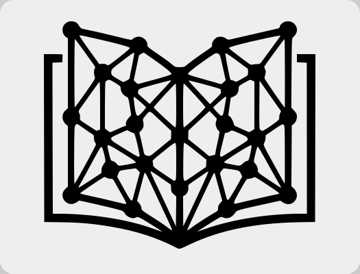
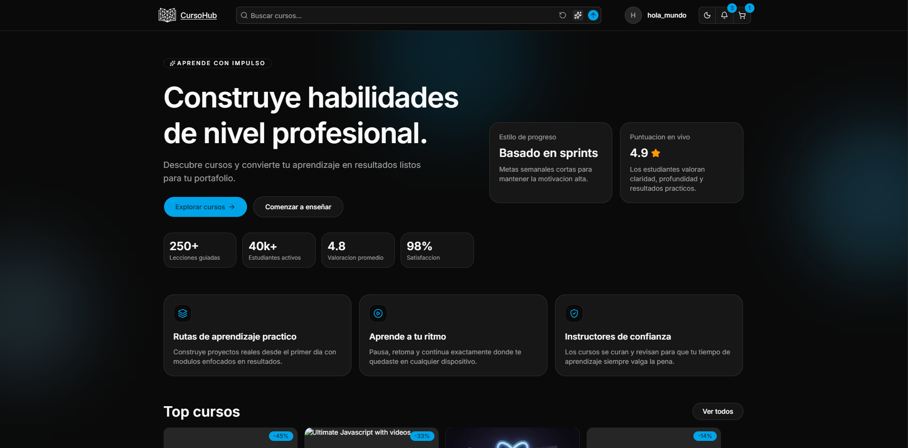
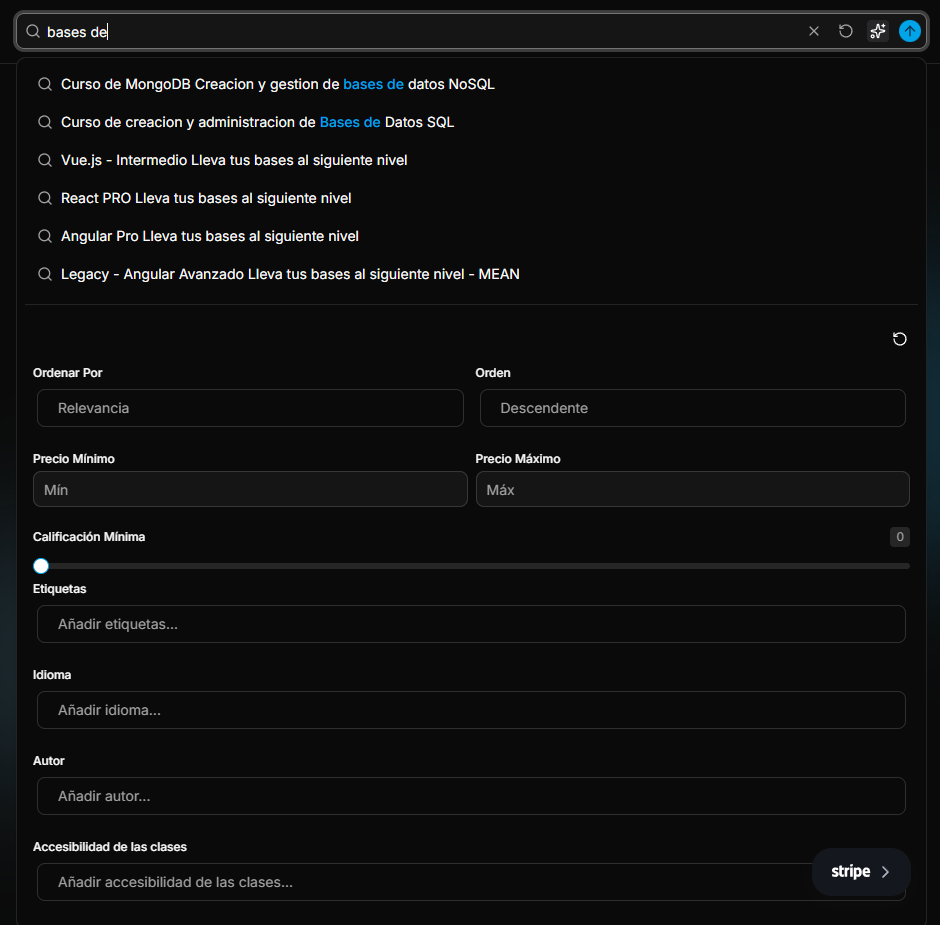
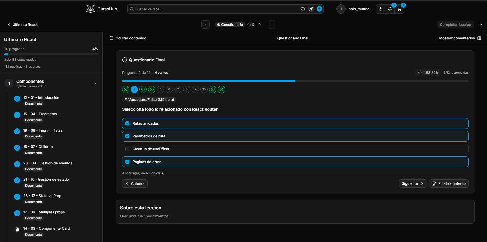
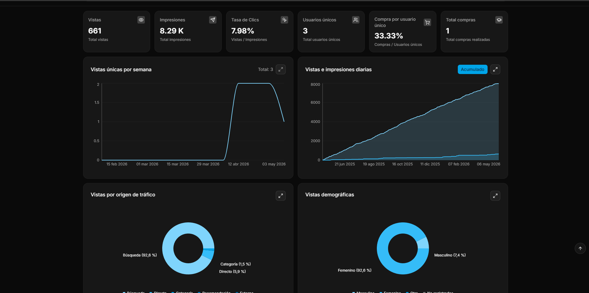
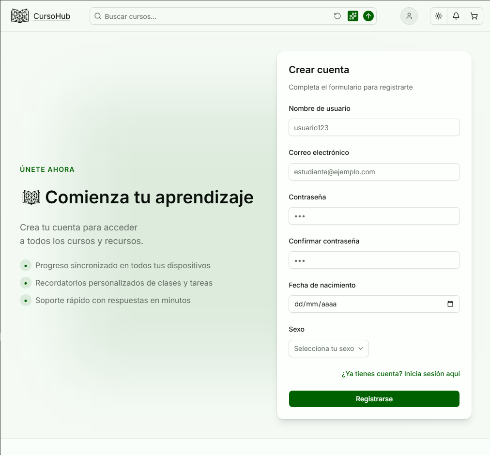
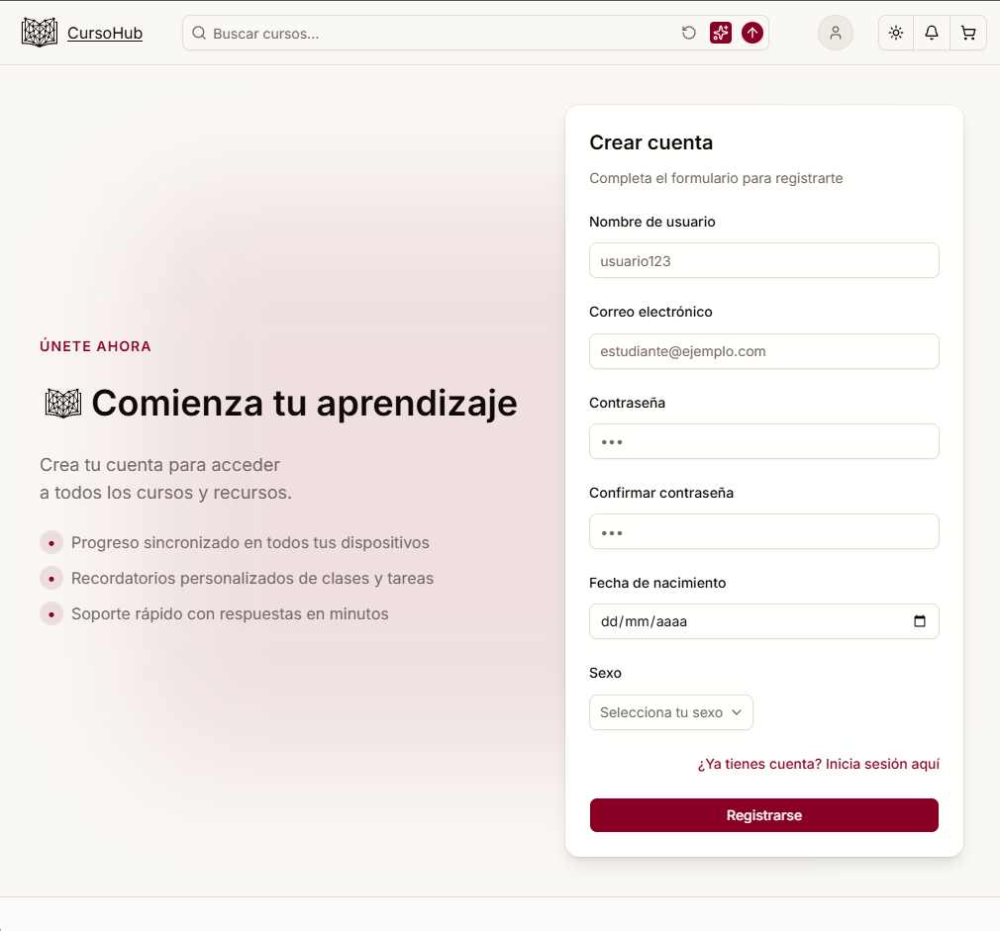
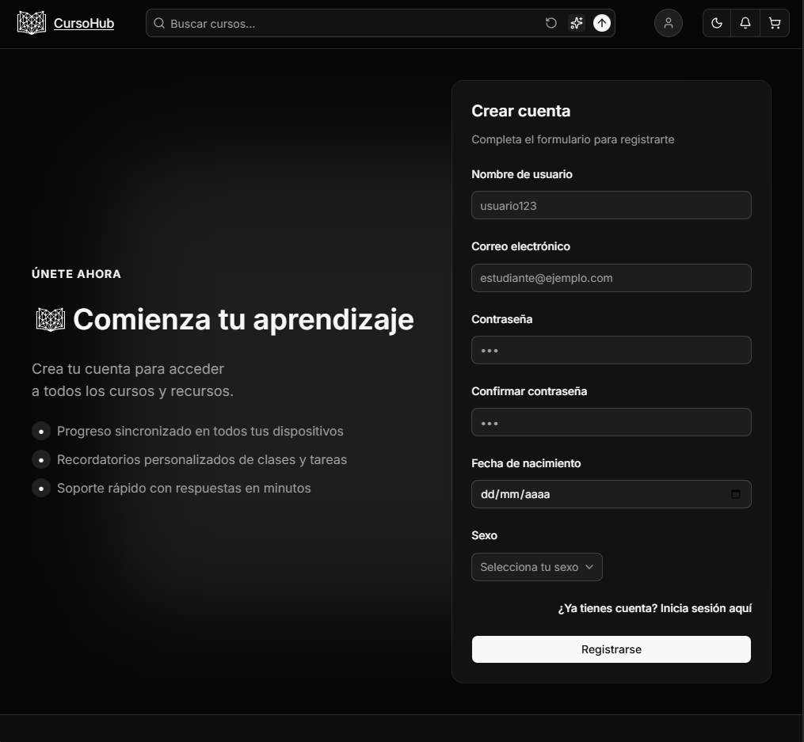
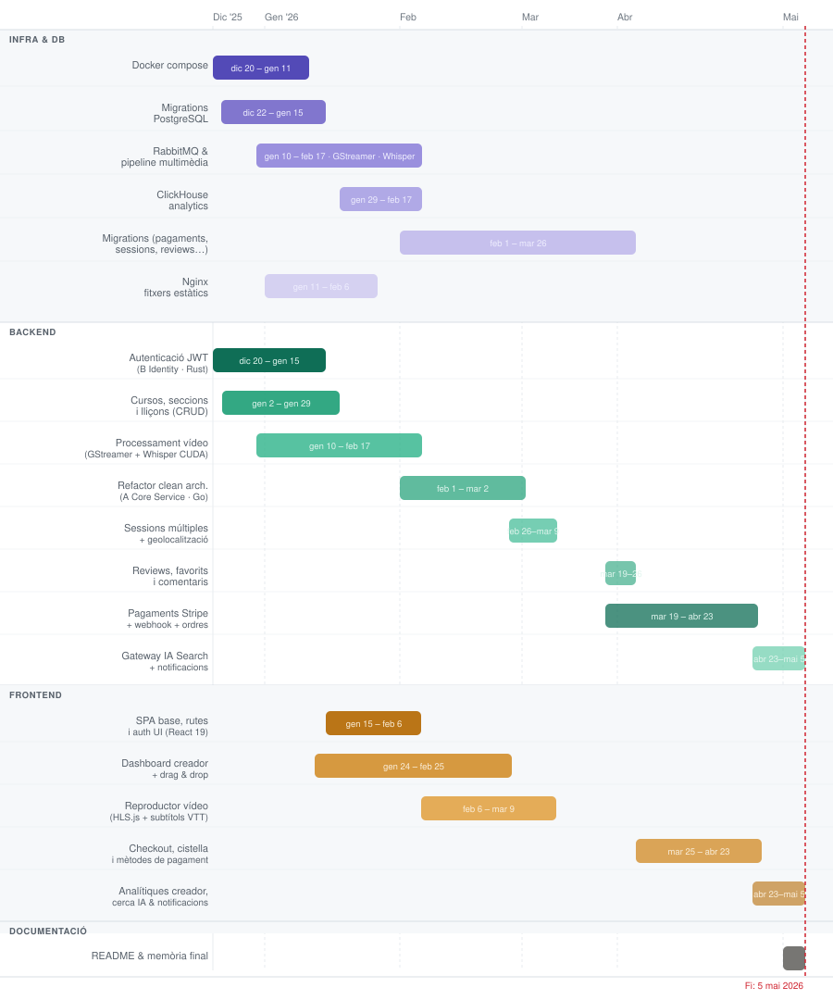

<div style="display: flex; align-items: center; gap: 12px;">
  
  <h1>CursoHub — Plataforma de Cursos Online</h1>
</div>

> Plataforma distribuïda de formació online amb arquitectura de microserveis, processament multimèdia asíncron, cerca amb IA i integració de pagaments.

> Github: <https://github.com/2jairo/courses_app>, Github Pages: <https://2jairo.github.io/courses_app/>

## Taula de continguts

1. [Introducció](#1-introducció)
   - 1.1. [Idea de negoci](#11-idea-de-negoci)
   - 1.2. [Objectius](#12-objectius)
   - 1.3. [Anàlisi del mercat i segmentació. Competència. DAFO](#13-anàlisi-del-mercat-i-segmentació-competència-dafo)
   - 1.4. [Alineació amb objectius, valors, sostenibilitat i futur (ODS)](#14-alineació-amb-objectius-valors-sostenibilitat-i-futur-ods)
2. [Anàlisi dels requeriments](#2-anàlisi-dels-requeriments)
   - 2.1. [Entitat Relació](#21-entitat-relació)
   - 2.2. [Diagrama de classes i casos d'ús](#22-diagrama-de-classes-i-casos-dús)
   - 2.3. [Disseny](#23-disseny)
   - 2.4. [Tecnologies](#24-tecnologies)
   - 2.5. [Planificació](#25-planificació)
3. [Implementació](#3-implementació)
   - 3.1. [Desplegament](#31-desplegament)
   - 3.2. [Backend](#32-backend)
   - 3.3. [Frontend](#33-frontend)
   - 3.4. [Disseny](#34-disseny)
4. [Millores futures](#4-millores-futures)
5. [Conclusions](#5-conclusions)
6. [Referències bibliogràfiques](#6-referències-bibliogràfiques)

---

## 1. Introducció

### 1.1. Idea de negoci

CursoHub és una plataforma digital on creadors puguen publicar cursos i estudiants puguen adquirir-los, consumir contingut multimèdia i fer seguiment del seu aprenentatge.

Punts clau:
- Monetització mitjançant compra de cursos i codis de regal.
- Escalabilitat amb serveis separats per funcionalitat (microserveis).
- Experiència d'usuari orientada a l'aprenentatge continu.
- Analítiques sobre el comportament dels usuaris per als creadors de cursos.

### 1.2. Objectius

**Generals:**
- Desenvolupar una plataforma robusta i escalable de formació online.
- Facilitar la gestió de cursos per part dels creadors.
- Oferir una experiència fluida a l'hora de compra i consum de cursos.

**Específics:**
- Implementar autenticació i gestió de perfils amb sessions múltiples.
- Permetre cerca i filtrat avançat de cursos amb IA (consultes en llenguatge natural).
- Integrar passarel·la de pagament (Stripe) amb suport de codis de regal.
- Proporcionar analítica bàsica per a creadors.
- Processar contingut multimèdia de forma asíncrona (transcodificació, transcripció).

### 1.3. Anàlisi del mercat i segmentació. Competència. DAFO

**Segmentació:**
- Segment principal: estudiants i professionals que volen millorar habilitats digitals.
- Segment secundari: creadors de contingut educatiu.
- Necessitat detectada: formació flexible, assequible i actualitzada.

**Competència:**
- Plataformes globals de formació online (Udemy, Coursera).
- Academies especialitzades en nínxols concrets.


### 1.4. Alineació amb objectius, valors, sostenibilitat i futur (ODS)

El projecte s'alinea amb:

<div style="display: flex; gap: 24px; flex-wrap: wrap; align-items: flex-start; margin: 16px 0;">
  <div style="text-align: center; max-width: 160px;">
    
    <p><strong>ODS 4</strong> — Educació de qualitat: accés a formació contínua.</p>
  </div>
  <div style="text-align: center; max-width: 160px;">
    
    <p><strong>ODS 8</strong> — Treball decent i creixement econòmic: impuls de competències professionals.</p>
  </div>
  <div style="text-align: center; max-width: 160px;">
    
    <p><strong>ODS 10</strong> — Reducció de desigualtats: facilitant accés remot al coneixement.</p>
  </div>
</div>

Valors del projecte: **Accessibilitat · Qualitat · Innovació · Millora contínua**

---

## 2. Anàlisi dels requeriments

### 2.1. Entitat Relació

Relacions principals:
- Un usuari pot crear múltiples cursos i inscriure's en múltiples cursos.
- Un curs té múltiples seccions; una secció té múltiples lliçons.
- Una lliçó admet quatre tipus: document, vídeo, questionari i laboratori.
- Una lliçó pot tenir múltiples arxius suplementaris.
- Els usuaris poden afegir ressenyes, marcar cursos com a favorits i deixar comentaris per lliçó.


### 2.2. Diagrama de classes i casos d'ús


### 2.3. Disseny

#### 2.3.1. Mockups

La plataforma suporta mode clar i fosc amb coherència visual i contrast adequat.

**Comparativa clar / fosc**

<div style="display: flex; gap: 20px; flex-wrap: wrap;">
  
  
</div>

**Mockups mode fosc**

<div style="display: flex; gap: 20px; flex-wrap: wrap;">
  
  
  
  
</div>

**Canvi de temes amb Shadcn UI**

Un dels factors clau per triar **Shadcn UI** es la seva facilitat per canviar de tema amb variables CSS, mantenint coherencia visual i una experiencia d'usuari consistent.

<div style="display: flex; gap: 20px; flex-wrap: wrap;">
  
  
  
</div>


#### 2.3.2. Paleta de colors

La plataforma utilitza una paleta basada en **Shadcn UI** amb colors en format OKLCH per a una millor percepció.

**Mode Clar (`:root`)**

| Mostra | Variable | Color (OKLCH) | Descripció |
| :---: | :--- | :--- | :--- |
|  | `--background` | `oklch(1 0 0)` | Fons de la pàgina |
|  | `--foreground` | `oklch(0.145 0 0)` | Text principal |
|  | `--primary` | `oklch(0.59 0.14 242)` | Color principal d'acció |
|  | `--secondary` | `oklch(0.967 0.001 286.375)` | Color secundari |
|  | `--accent` | `oklch(0.97 0 0)` | Color de ressaltat |
|  | `--destructive` | `oklch(0.58 0.22 27)` | Error o accions destructives |
|  | `--border` | `oklch(0.922 0 0)` | Vores dels elements |

**Mode Fosc (`.dark`)**

| Mostra | Variable | Color (OKLCH) | Descripció |
| :---: | :--- | :--- | :--- |
|  | `--background` | `oklch(0.145 0 0)` | Fons en mode fosc |
|  | `--foreground` | `oklch(0.985 0 0)` | Text principal en mode fosc |
|  | `--primary` | `oklch(0.68 0.15 237)` | Color principal d'acció |
|  | `--secondary` | `oklch(0.274 0.006 286.033)` | Color secundari |
|  | `--accent` | `oklch(0.371 0 0)` | Color de ressaltat |
|  | `--destructive` | `oklch(0.704 0.191 22.216)` | Error o accions destructives |
|  | `--border` | `oklch(1 0 0 / 10%)` | Vores dels elements |

#### 2.3.3. Usabilitat

- Navegació fluida (SPA) i clara entre aprenentatge i gestió.
- Temps de càrrega reduïts mitjançant lazy loading i React Query.
- Disseny responsive per dispositius mòbils i escriptori.
- Feedback visual en totes les accions de l'usuari.

### 2.4. Tecnologies

Stack tecnològic complet de la plataforma:

| Logo | Àrea | Servei | Tecnologies | Ports | Rol | Expuesto |
| :---: | --- | --- | --- | :---: | --- | --- |
|  | **Backend** | A Core service / D client service | [Go 1.25](https://go.dev/dl/), [Fiber](https://github.com/gofiber/fiber), [GORM](https://github.com/go-gorm/gorm), [Stripe](https://github.com/stripe/stripe-go) | 3000 | Servei principal de negoci: cursos, compres, cerca, analítiques | Sí |
|  | **Backend** | B Identity service | [Rust 1.89](https://rust-lang.org/tools/install/), [Axum](https://github.com/tokio-rs/axum), [Tokio](https://tokio.rs/), [SeaORM](https://www.sea-ql.org/SeaORM/) | 3001 | Autenticació, sessions, gestió de perfil | Sí |
|  | **Backend** | C Media service | [Rust 1.89](https://rust-lang.org/tools/install/), [GStreamer](https://gstreamer.freedesktop.org/), [Whisper (CUDA)](https://github.com/openai/whisper) | — | Processament multimèdia asíncron | No |
|  | **Backend** | Gateway IA search | [Node.js](https://nodejs.org/), [TypeScript](https://www.typescriptlang.org/), [Express](https://expressjs.com/) | 3003 | Gateway IA amb fallback entre proveïdors NL | No |
|  | **Backend** | Migrations | [TypeScript](https://www.typescriptlang.org/), [migrate](https://github.com/golang-migrate/migrate) | — | Migracions PostgreSQL/ClickHouse i Typesense | No |
|  | **Frontend** | Web SPA | [React 19](https://react.dev/), [Vite](https://vitejs.dev/), [Tailwind](https://tailwindcss.com/), [Shadcn UI](https://ui.shadcn.com/) | 5173 | Interfície d'usuari completa | Sí |
|  | **Desplegament** | [Docker](https://www.docker.com/) | Docker | — | Orquestra serveis, BD i persistència | No |
|  | **BD** | [PostgreSQL](https://www.postgresql.org/) | SQL relacional | 5432 | Dades transaccionals principals | No |
|  | **BD** | [ClickHouse](https://clickhouse.com/) | OLAP columnar | 8123 | Analítica d'events i mètriques | No |
|  | **BD** | [Redis](https://redis.io/) | Key-value en memòria | 6379 | Cache, sessions i tokens | No |
| <svg xmlns="http://www.w3.org/2000/svg" width="110" height="24" viewBox="0 0 512 114"><path fill="#1035BC" d="M31.032 32.624a17 17 0 0 1 .342 3.297q0 1.477-.342 3.182l-14.436-.113v38.193q0 4.775 4.433 4.775h8.64q.795 1.932.795 3.864q0 1.933-.227 2.388a83 83 0 0 1-10.799.682q-11.026 0-11.026-9.435V38.99l-8.071.113A16.3 16.3 0 0 1 0 35.921q0-1.592.341-3.297l8.07.114V20.802q0-3.069.91-4.32q.91-1.364 3.524-1.364h3.07l.681.682v17.051zm55.005.568L70.464 86.505q-4.32 14.663-9.207 20.688t-14.664 6.025q-5.001 0-9.207-1.478q-.341-3.183 1.818-6.138q3.524 1.25 7.503 1.25q6.024 0 9.207-4.092t5.798-12.732l.34-1.136q-2.955-.228-4.546-1.364q-1.478-1.137-2.501-4.206L39.09 33.306q3.523-1.478 5.001-1.478q3.297 0 4.434 3.979l9.271 29.468q.999 3.292 4.938 16.796q.227.796 1.136.796l13.87-50.243q1.479-.455 3.865-.455q2.502 0 4.206.682zm21.842 51.494v22.507q0 3.069-.909 4.32q-.91 1.363-3.638 1.363h-3.069l-.682-.682V32.965l.682-.682h2.956q2.517 0 3.487 1.26l.15.218q1.023 1.364 1.023 4.547v.568q6.821-7.616 16.255-7.616q9.663 0 14.55 7.843q4.89 7.73 4.889 21.484q0 6.707-1.82 12.05q-1.704 5.342-4.66 9.093q-2.841 3.638-6.593 5.684q-3.75 1.932-7.73 1.932q-7.407 0-14.105-4.157zm0-36.944v29.214q6.934 5.115 13.073 5.115q6.138 0 10.116-5.456q3.98-5.456 3.98-16.482q0-4.96-.846-8.7l-.178-.735q-.91-4.092-2.5-6.707q-1.433-2.456-3.326-3.713l-.426-.265q-2.046-1.364-4.433-1.364q-4.547 0-8.64 2.387q-3.776 2.203-6.392 6.053zm93.253 15.346h-35.238q.569 19.324 14.664 19.324q7.73 0 16.482-4.774q2.5 2.274 3.07 5.797q-9.323 6.366-20.916 6.366q-5.911 0-10.117-2.16a20 20 0 0 1-6.934-6.138q-2.615-3.979-3.865-9.321q-1.25-5.343-1.25-11.708q0-6.48 1.477-11.822q1.592-5.343 4.547-9.208q2.956-3.865 7.048-6.024q4.205-2.16 9.548-2.16q4.794 0 8.631 1.624l.69.308q3.855 1.668 6.47 4.576l.464.54q2.843 3.182 4.32 7.73q1.478 4.433 1.478 9.548q0 2.046-.228 3.978q-.075 1.213-.202 2.375zm-35.238-6.48h27.281v-1.477q0-7.843-3.296-12.618q-3.297-4.773-9.89-4.774q-6.48 0-10.117 5.116q-3.327 4.83-3.918 12.805zm46.94 27.85q.112-2.5 1.362-5.456q1.365-3.069 3.07-4.774q8.98 4.887 15.8 4.888q3.751 0 6.025-1.478q2.387-1.478 2.388-3.978q0-3.98-6.14-6.366l-6.365-2.387q-14.323-5.229-14.323-16.71q0-4.092 1.479-7.275q1.59-3.297 4.319-5.57q2.841-2.387 6.707-3.637q3.864-1.25 8.639-1.25q2.158 0 4.774.34q2.728.341 5.455 1.023q2.729.57 5.23 1.364q2.5.796 4.319 1.705q0 2.842-1.137 5.911q-1.135 3.07-3.07 4.547q-8.979-3.978-15.571-3.978q-2.956 0-4.661 1.478q-1.705 1.363-1.705 3.637q0 3.525 5.684 5.57l6.934 2.5q7.501 2.615 11.14 7.162q3.638 4.547 3.638 10.572q-.001 8.07-6.026 12.958q-6.025 4.774-17.277 4.774q-11.029 0-20.688-5.57m99.624-19.438h-31.373q.342 6.253 2.84 9.89q2.617 3.524 8.98 3.524q6.594 0 15.12-3.865q3.296 3.41 4.206 8.98q-9.095 6.48-21.824 6.48q-12.05 0-18.303-7.39q-6.137-7.501-6.137-22.165q0-6.821 1.592-12.277q1.59-5.57 4.659-9.435q3.07-3.978 7.502-6.138t10.118-2.16q5.797 0 10.23 1.819q4.434 1.706 7.502 5.001q3.07 3.183 4.548 7.616q1.59 4.434 1.591 9.663q-.001 2.841-.341 5.456a57 57 0 0 1-.64 3.751zM290.52 41.15q-8.866 0-9.549 13.413h18.869v-1.364q0-5.457-2.273-8.753q-2.14-3.103-6.494-3.285zm84.237 9.32v24.78q-.001 7.276 2.386 10.8q-3.638 3.183-8.752 3.183q-4.889 0-6.707-2.16q-1.82-2.274-1.82-7.048V53.54q0-5.116-1.25-7.162t-4.66-2.046q-6.025 0-11.254 5.457v38.648a26.5 26.5 0 0 1-3.637.455a60 60 0 0 1-3.751.113q-1.933 0-3.865-.113a26 26 0 0 1-3.524-.455V32.17l.681-.795h5.684q6.367 0 7.957 6.82q8.298-7.161 16.483-7.162q8.186 0 12.05 5.343q3.789 4.98 3.97 13.26zm11.924 33.988q.112-2.5 1.363-5.456q1.365-3.069 3.07-4.774q8.978 4.887 15.8 4.888q3.75 0 6.024-1.478q2.387-1.478 2.388-3.978q0-3.98-6.139-6.366l-6.366-2.387Q388.5 59.678 388.5 48.197q0-4.092 1.478-7.275q1.59-3.297 4.32-5.57q2.84-2.387 6.707-3.637q3.863-1.25 8.638-1.25q2.159 0 4.774.34q2.728.341 5.456 1.023q2.728.57 5.229 1.364q2.501.796 4.32 1.705q0 2.842-1.137 5.911q-1.137 3.07-3.07 4.547q-8.98-3.978-15.572-3.978q-2.956 0-4.661 1.478q-1.705 1.363-1.705 3.637q0 3.525 5.685 5.57l6.933 2.5q7.502 2.615 11.14 7.162t3.638 10.572q-.001 8.07-6.026 12.958q-6.025 4.774-17.277 4.774q-11.028 0-20.688-5.57m99.624-19.438h-31.373q.343 6.253 2.841 9.89q2.616 3.524 8.98 3.524q6.593 0 15.12-3.865q3.294 3.41 4.206 8.98q-9.095 6.48-21.825 6.48q-12.049 0-18.302-7.39q-6.138-7.501-6.137-22.165q-.001-6.821 1.591-12.277q1.59-5.57 4.66-9.435q3.068-3.978 7.503-6.138q4.431-2.16 10.117-2.16q5.795 0 10.23 1.819q4.433 1.706 7.502 5.001q3.068 3.183 4.547 7.616q1.591 4.434 1.592 9.663q0 2.841-.342 5.456a57 57 0 0 1-.64 3.751zm-21.938-23.87q-8.865 0-9.548 13.413h18.87v-1.364q-.001-5.457-2.275-8.753q-2.272-3.297-7.047-3.297m39.562 63.202V.341q1.704-.34 3.866-.341q2.273 0 4.204.341v104.01q-1.931.34-4.204.341q-2.162 0-3.866-.34"/></svg> | **Cerca** | [Typesense](https://typesense.org/) | Motor de cerca | 8108 | Indexació i cerca avançada de cursos | No |
|  | **Missatgeria** | [RabbitMQ](https://www.rabbitmq.com/) | Broker AMQP | 5672 / 15672 | Comunicació asíncrona entre serveis | No |
|  | **Fitxers estàtics** | [Nginx](https://nginx.org/) | Servidor web | 8080 | Fitxers multimèdia processats | Sí |

#### 2.4.1. Desplegament

L'orquestració es fa amb Docker. Dos fitxers permeten arrancar el stack complet o només les bases de dades per a desenvolupament local.

#### 2.4.2. Backend

L'arquitectura backend es basa en quatre serveis independents comunicats via HTTP (S2S) i missatgeria asíncrona (RabbitMQ):

| Servei | Llenguatge / Framework | Responsabilitat principal |
|---|---|---|
| A Core Service / D client service | Go 1.25, Fiber, GORM | Lògica de negoci, cursos, pagaments, cerca, analítiques |
| B Identity Service | Rust 1.89, Axum, SeaORM | Autenticació, sessions, JWT |
| C Media Service | Rust 1.89, GStreamer, Whisper | Processament asíncron de vídeo i àudio |
| Gateway IA Search | Node.js, TypeScript, Express | Cerca en llenguatge natural amb LLMs |

Bases de dades: **PostgreSQL · ClickHouse · Redis · Typesense**

#### 2.4.3. Frontend

Aplicació SPA construida amb React 19, Vite i components de Shadcn UI.

| Categoria | Llibreria |
|---|---|
| Components UI | Shadcn UI, Tailwind CSS |
| Formularis | React Hook Form + Zod |
| Dades | React Query, Axios |
| Editor de text | Lexical (Shadcn UI) |
| Gràfics | Recharts (Shadcn UI) |
| Vídeo | HLS.js + subtítols VTT |
| Drag & Drop | dnd-kit |
| Pagament | Stripe JS |
| Temes | next-themes (Shadcn UI) |

#### 2.4.4. Disseny

L'estil visual es basa en el sistema de disseny de **Shadcn UI** amb components accessibles i altament personalitzables.

- **Shadcn UI** — biblioteca de components basada en Radix UI i Tailwind CSS.
- **Tailwind CSS** — utilitats CSS per a un disseny més cómode, consistent i responsive.
- **OKLCH** — espai de color perceptualment uniforme per a la paleta de la plataforma.
- **next-themes** — gestió de tema clar/fosc amb persistència.
- **ToolTips** — disponibles en la gran majoria de botons per oferir informació contextual.

### 2.5. Planificació

#### 2.5.1. Diagrama de Gantt



---

## 3. Implementació

### 3.1. Desplegament

L'orquestració es fa amb dos fitxers Docker Compose:

| Fitxer | Propòsit |
|---|---|
| `docker-compose.yaml` | Stack complet: serveis + bases de dades |
| `docker-compose-databases.yaml` | Només bases de dades (per a dev local) |

**Persistència de dades (volums locals):**

```
./dbs/
├── postgres_data/       # Dades PostgreSQL
├── redis_data/          # Dades Redis
├── clickhouse/          # Dades i logs ClickHouse
├── rmq_data/            # Dades RabbitMQ
└── typesense-data/      # Índex Typesense
```

**Iniciar el projecte:**
```bash
# Stack complet
docker compose up -d

# Només bases de dades (per a dev local)
docker compose -f docker-compose-databases.yaml up -d
```

**Variables d'entorn:**

| Fitxer | Servei |
|---|---|
| `backend/A_core_service/.env.*` | Core service |
| `backend/B_identity_service/.env.*` | Identity service |
| `backend/gateway_IA_search/.env.*` | Gateway IA |
| `frontend/.env.*` | Frontend |

### 3.2. Backend

### 3.3. Frontend

Aplicació SPA amb React 19. Totes les rutes protegides requereixen autenticació JWT activa.
**Fluxe peticions:** [Aggregator](./assets/aggregator.html)

### 3.4. Disseny

**Mode clar i fosc:** implementat amb `next-themes` i variables CSS OKLCH. El canvi de tema és instantani i persistent entre sessions.

**Responsive:** disseny adaptatiu per a mòbil i escriptori mitjançant les utilitats de Tailwind CSS.

**Components:** tots els elements interactius (formularis, modals, taules, gràfics) utilitzen Shadcn UI amb accessibilitat integrada (ARIA, navegació per teclat).

**Feedback visual:** indicadors de càrrega, missatges d'error i confirmació en totes les accions de l'usuari gestionats amb React Query i React Hook Form + Zod.

---

## 4. Millores futures

| Prioritat | Millora |
|---|---|
| Alta | Internacionalització (i18n) — castellà, anglès |
| Mitjana | Asistent especialitzat en curs actual |
| Mitjana | Aplicació mòbil nativa (React Native) |
| Mitjana | Més analítica per creadors (embut de conversió, heatmaps) |
| Baixa | Integració amb certificacions externes |
| Baixa | Sistema de cursos en directe (streaming) |


## 5. Conclusions

### 5.1. Personals

El projecte ha permès consolidar competències en planificació de sistemes distribuïts, comunicació tècnica, resolució de problemes complexos i treball orientat a producte. La implementació de múltiples tecnologies en paral·lel (Go, Rust, Node.js, React) ha reforçat la capacitat d'adaptar-se a entorns políglottes.

### 5.2. Tècniques

A nivell tècnic, s'ha validat una arquitectura modular capaç de créixer, amb separació clara de responsabilitats entre:
- Serveis de negoci (A Core / D Client).
- Serveis d'identitat (B Identity).
- Workers asíncrons (C Media).
- Gateways especialitzats (IA Search).

La combinació de PostgreSQL per a dades transaccionals, ClickHouse per a analítiques i Typesense per a cerca demostra que una arquitectura poliglota de bases de dades és viable i eficient per a plataformes d'aquest tipus.

---

## 6. Referències bibliogràfiques

- [Documentació oficial de React](https://react.dev)
- [Documentació oficial de Go (Fiber)](https://gofiber.io)
- [Documentació oficial de Rust (Axum)](https://docs.rs/axum)
- [Documentació oficial de Docker](https://docs.docker.com)
- [Documentació oficial de Typesense](https://typesense.org/docs)
- [Documentació oficial de ClickHouse](https://clickhouse.com/docs)
- [Documentació oficial de Stripe](https://stripe.com/docs)
- [Documentació de Shadcn UI](https://ui.shadcn.com)
- [Material sobre ODS — Nacions Unides](https://sdgs.un.org)
- [Nielsen Norman Group — Principis d'usabilitat](https://www.nngroup.com)
  